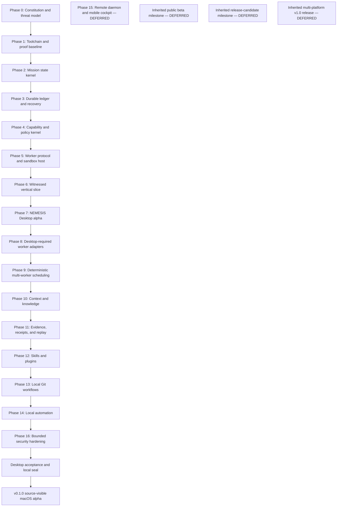

# NEMESIS Desktop Dependency Graph

This graph compiles the architect-authorized contracts into the macOS-first desktop scope. The desktop contract at `docs/mission/NEMESIS_DESKTOP_MASTER_BUILD_MISSION_2026-08-20.md` governs the product boundary; the GitHub release contract at `docs/mission/NEMESIS_FULL_AUTONOMOUS_GITHUB_RELEASE_MISSION_2026-08-20.md` authorizes the source-visible macOS alpha release. This file orders work; it does not broaden either contract.

## Locked identity

- **Name:** NEMESIS
- **Descriptor:** The Provable Agent Operating System
- **Tagline:** Autonomy under control.
- **Doctrine:** Intelligence proposes. NEMESIS governs. Evidence decides.
- **Local product components:** NEMESIS Desktop, Core, Kernel, Runtime, Grid, Forge, Vault, Evidence, Replay, Protocol, and SDK.
- **CLI namespace:** `nemesis`.

## Dependency order

## Phase contracts

| Phase | Desktop output | Executable gate | Depends on |
|---|---|---|---|
| 0 | Constitution, threat model, trust boundaries, security policy, governance, evidence policy, vertical-slice acceptance | `scripts/verify_phase0.sh` rejects missing identity, doctrine, scope, or gate documents | Architect contract |
| 1 | Alire/GPR project, SPARK skeleton, strict compiler settings, local proof receipt | Ada build and selected GNATprove checks complete without undocumented suppression | 0 |
| 2 | Bounded mission states, transition authority, terminal-state rules, sequence discipline | Exhaustive transition-pair tests and serialization round trip | 1 |
| 3 | Append-only hash-chained ledger, checkpoints, corruption/truncation detection, deterministic recovery | Crash-boundary battery recovers one state or refuses corrupted state | 2 |
| 4 | Typed capabilities, attenuation, expiry, revocation, budgets, normalized one-shot approvals | Traversal, symlink, replay, cross-mission reuse, escalation, and default-deny tests | 3 |
| 5 | Versioned worker protocol, deterministic untrusted worker, isolated worktree lane, fail-closed macOS sandbox | Malicious worker cannot escape, forge state, reuse approval, access network/secrets, or mark complete | 4 |
| 6 | Create/authorize/run/restart/verify/tamper vertical slice, local signed receipt, independent verifier | Valid final-source-bound receipt verifies; one-byte mutations fail | 5 |
| 7 | Tauri 2 + React/TypeScript desktop app with onboarding, mission composer/review/cockpit, approvals, evidence and replay | The Phase 6 flow is operated entirely in the app and survives app/daemon restart | 6 |
| 8 | Generic subprocess, Codex, Claude Code, OpenAI, Anthropic, and local adapters only when locally configured | Swaps preserve contract and authority; missing providers produce typed unavailable status | 7 |
| 9 | Roles, task graph, isolated lanes, builder/reviewer separation, deterministic commits | Races cannot mutate authority; conflicts remain explicit; builder cannot self-accept elevated evidence | 8 |
| 10 | Provenance-aware knowledge and signed bounded context capsules | Replacement retains obligations; stale/revoked/contradictory facts remain labeled | 9 |
| 11 | Typed evidence graph, invalidation, causal replay, forks, standalone receipt verifier | Old-source evidence cannot complete new source; replay reconstructs authority decisions | 10 |
| 12 | Staged skills, capability manifests, isolated WASI/backend and webview UI plugins, bounded MCP gateway | Plugins and skills cannot inherit or promote authority implicitly | 11 |
| 13 | Local repository/worktree/commit preparation and CI-observation import; no push/merge execution | Push/merge/delete-remote petitions refuse without unavailable external authority | 12 |
| 14 | Local schedules/triggers/offline queue with denial at unattended approval boundaries | Unattended work refuses instead of widening authority or waiting indefinitely | 13 |
| 16 | Protocol mutation and malicious-fixture gates in an approved Apple Virtualization guest; dependency/threat/proof review | Every accepted finding has a regression fixture; host is not used for crash/fuzz/exploit evidence | 14 |
| Seal | Reproducible local desktop acceptance battery, phase receipts, restart-safe checkpoint | `scripts/verify_complete.sh` validates current source and every mandatory desktop predicate | 16 |
| Release | Public source repository, hosted CI, ad-hoc macOS arm64 app, checksums, manifest, release notes, and final receipts | Required hosted checks succeed; final-commit app passes package/leak/signature/smoke gates; published assets re-download with identical SHA-256 values | Seal + release contract |

## Explicitly deferred requirements

The following are outside the bounded mission and are not counted as complete:

- iPhone and iPad applications, SwiftUI mobile cockpit, Apple Pencil directives, mobile notifications, device enrollment, remote mobile approval, and lost-device revocation.
- Hosted web application or dashboard, public cloud service, public messaging gateway, public webhook endpoint, and remote public daemon deployment.
- Windows and Linux applications, installers, and build matrices.
- Developer ID signing, notarization, TestFlight, App Store, immutable release attestations, and SBOM publication.
- Package registration, domain acquisition, and permanent ecosystem registration.
- Legal clearance. Bounded public-name reconnaissance is recorded with limitations; no uniqueness or legal conclusion is claimed.
- The inherited broad public-beta, release-candidate, and multi-platform GitHub `1.0` milestones. The authorized source-visible macOS `v0.1.0` alpha does not satisfy or claim those milestones.

## Fail-closed sequencing

A later phase may begin only after its dependency gate has a source-bound receipt. A failed verifier remains failure. A missing external provider produces a typed unavailable or blocked result, never a fabricated pass. Deferred work remains `DEFERRED`; it is neither implemented nor treated as a desktop failure.
